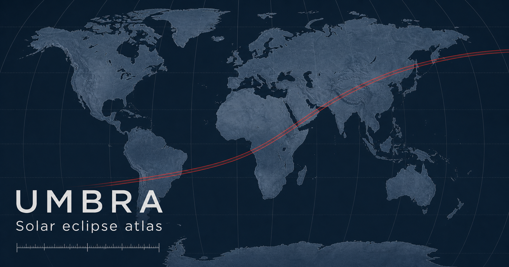

# Umbra

A mobile-first solar eclipse atlas for exploring the Moon’s shadow and planning what you will see from any point on Earth.

**[Open the live atlas →](https://umbra-eclipse.plhery.com/)**



## What it does

- Browse 11,898 solar eclipses from astronomical year −1999 through 3000.
- Follow the central path, partial-visibility region, center line, and moving shadow.
- Tap or click anywhere for local contact times, coverage, totality or annularity duration, Sun altitude, and azimuth.
- See upcoming total and partial eclipses for a selected location.
- Check the terrain skyline automatically in the direction of maximum eclipse, with links to PeakFinder, Google Maps, and Street View.
- Scrub or play the eclipse timeline, switch map and analysis layers, and compare up to three events.
- Share an exact map state, save locations, add an eclipse to a calendar, or export GeoJSON, KML/KMZ, GPX, and CSV.

The interface is designed mobile-first for use in the field, while keeping the deeper planning and analysis tools available on larger screens.

## Run locally

Umbra requires Node.js 22.13 or newer and pnpm.

```bash
corepack enable
pnpm install
cp .env.example .env.local
pnpm dev
```

Open [http://localhost:3000](http://localhost:3000). No API keys or database are required.

Before opening a pull request:

```bash
pnpm lint
pnpm build
```

## Project structure

- `components/eclipse-explorer.tsx` — the atlas interface and interaction state
- `lib/eclipse.ts` — eclipse catalogue, geometry, and local circumstances
- `lib/map-data.ts` — MapLibre sources, layers, and calculated overlays
- `lib/services.ts` — geocoding, elevation, and terrain skyline helpers
- `app/api/geocode/route.ts` — rate-limited OpenStreetMap geocoding proxy
- `DESIGN.md` — product principles, personas, and interface priorities

## Calculations and data

Eclipse predictions use Besselian elements from NASA’s Five Millennium Canon through [`@astronomy-bundle/solar-eclipse`](https://github.com/andrmoel/astronomy-bundle-js). Map data and geocoding come from OpenStreetMap; terrain profiles use Open-Meteo’s Copernicus DEM elevation service. Other map styles retain the attribution shown directly on the map.

Umbra is a planning aid, not an official prediction service. Small differences can result from atmospheric refraction, terrain resolution, ΔT, and the Moon’s irregular limb. Verify critical plans against an official source.

Never look at the bright Sun without certified eclipse glasses. Ordinary sunglasses are not safe; eye protection comes off only during the fully total phase of a total solar eclipse.

## Contributing

Bug reports and focused improvements are welcome. Read [CONTRIBUTING.md](CONTRIBUTING.md) before making a substantial change. Security issues should be reported privately as described in [SECURITY.md](SECURITY.md).

Umbra is an independent clean-room project inspired by [Xavier Jubier’s interactive eclipse maps](http://xjubier.free.fr/en/site_pages/SolarEclipsesGoogleMaps.html).

## License

The source code is available under the [MIT License](LICENSE). Third-party maps, catalogue data, imagery, fonts, and services remain subject to their respective terms.
